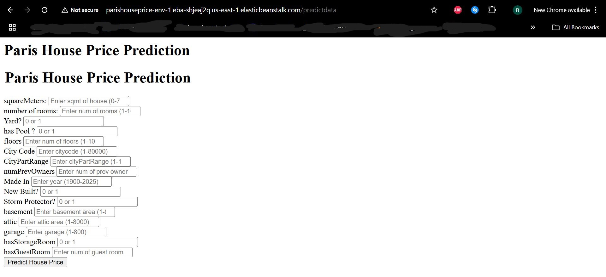
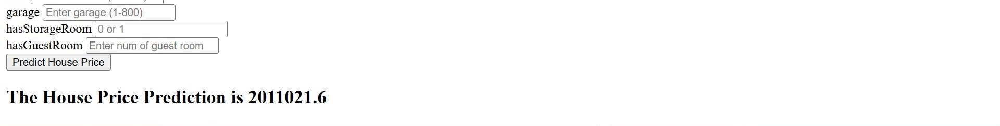

## End-to-End Machine Learning Project

# Paris House Price Prediction

## Overview

This project is an end-to-end machine learning solution for predicting house prices in Paris. The dataset was sourced from Kaggle, and the model was trained using various regression techniques. The final deployment was done on AWS using CodePipeline.

## Features

The dataset includes the following features:

- **id**: Unique identifier
- **squareMeters**: Size of the house in square meters
- **numberOfRooms**: Total number of rooms
- **hasYard**: Presence of a yard (0/1)
- **hasPool**: Presence of a swimming pool (0/1)
- **floors**: Number of floors
- **cityCode**: Encoded city identifier
- **cityPartRange**: Encoded part of the city
- **numPrevOwners**: Number of previous owners
- **made**: Year the house was built
- **isNewBuilt**: Whether the house is newly built (0/1)
- **hasStormProtector**: Presence of storm protection (0/1)
- **basement**: Area of a basement 
- **attic**: Area of an attic (0/1)
- **garage**: Number of garage
- **hasStorageRoom**: Presence of a storage room (0/1)
- **hasGuestRoom**: Number of guest rooms

## Project Workflow

1. **Dataset Selection**: Retrieved from Kaggle.
2. **Exploratory Data Analysis (EDA)**: Conducted statistical analysis and data visualization.
3. **Feature Engineering**: Processed missing values, transformed features, and normalized data.
4. **Model Training**: Applied multiple regression models and selected the best one based on performance metrics.
5. **Hyperparameter Tuning**: Optimized model parameters for better performance.
6. **Deployment**: Hosted the model on AWS using CodePipeline for continuous deployment.

## Screenshots

## Result

# Postman Testing of API :

## Technologies Used

- Python
- Scikit-Learn
- Pandas & NumPy
- Matplotlib & Seaborn
- Pickle
- AWS (CodePipeline, Elastic Beanstalk)
- Flask

# AWS Deployment Link :

AWS Elastic Beanstalk link : [http://parishouseprice-env-1.eba-shjeaj2q.us-east-1.elasticbeanstalk.com/predictdata](http://parishouseprice-env-1.eba-shjeaj2q.us-east-1.elasticbeanstalk.com/predictdata)

